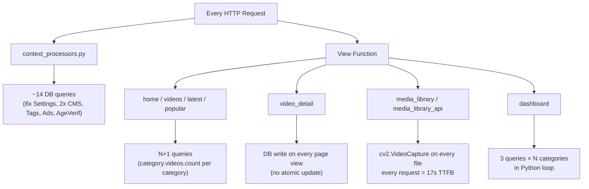

# Performance Optimization Plan

## Root Cause Summary




## Changes by File

### 1. `[adulto/settings.py](adulto/settings.py)`

- `DEBUG = True` → `DEBUG = os.getenv('DEBUG', 'False').lower() == 'true'`
- `SESSION_SAVE_EVERY_REQUEST = True` → `SESSION_SAVE_EVERY_REQUEST = False` (eliminates DB write on every request)

### 2. `[adulto/context_processors.py](adulto/context_processors.py)`

This runs on **every request** and currently fires ~14 DB queries.

- Wrap entire `cms_and_settings` result in `cache.get_or_set('cms_context', ..., 300)`
- Replace 8 separate `Settings.get_setting()` calls with a single `Settings.objects.values('key', 'value')` dict lookup
- Result: **14 queries → 0 queries** on cached requests (refreshes every 5 minutes)

### 3. `[app/views.py](app/views.py)`

- `**home()`**: Add `.select_related('uploader').prefetch_related('category', 'tags')` to video queryset; annotate categories: `Category.objects.annotate(videos_count=Count('videos', filter=Q(videos__is_active=True)))`; reduce pagination from 50 → 20
- `**videos()`**: Same prefetch + category annotation + reduce to 20/page
- `**latest()` / `popular()`**: Add `.prefetch_related('category', 'tags')`; reduce to 20/page
- `**categories()`**: Use annotated queryset so template doesn't fire per-category queries
- `**tags()**`: `Tag.objects.annotate(videos_count=Count('videos', filter=Q(videos__is_active=True)))`
- `**video_detail()**`: Replace race-condition-prone increment with atomic F() expression:
  - `Video.objects.filter(pk=video.pk).update(views=F('views') + 1)` (no read-modify-write)

### 4. `[core/views.py](core/views.py)`

- `**dashboard()` category loop** (lines 91–102): Replace 3-queries-per-category Python loop with a single annotated queryset:

```python
videos_by_category = Category.objects.annotate(
    count=Count('videos'),
    total_views=Sum('videos__views'),
    total_likes=Sum('videos__likes'),
).filter(count__gt=0).values('name', 'count', 'total_views', 'total_likes')
```

- `**media_library()` and `media_library_api()**` (the #1 cause of 17s TTFB): Replace `cv2.VideoCapture()` per-file loop with a DB lookup — the `Video` model already has a `duration` field. Build a `filename → duration` dict from the DB once, then use it:

```python
db_durations = {
    os.path.basename(v.video_file.name): v.duration
    for v in Video.objects.exclude(video_file='').only('video_file', 'duration')
}
# Then: duration = db_durations.get(filename, 0)
```

  This eliminates all cv2 file I/O during page loads. cv2 is still used only when generating thumbnails (signals/background tasks), not on request.

### 5. Templates — Fix N+1 `category.videos.count` calls

After view changes pass annotated querysets, update templates to use the pre-computed field (`videos_count`) instead of calling `.count` on the relation (which fires a DB query per item):

- `[templates/site/home.html](templates/site/home.html)`: `category.videos.count` → `category.videos_count`; also remove leftover debug `console.log` blocks (lines 38–51, 89–97, 153–161)
- `[templates/site/videos.html](templates/site/videos.html)`: same `category.videos.count` → `category.videos_count`
- `[templates/site/categories.html](templates/site/categories.html)`: 3 occurrences of `category.videos.count` → `category.videos_count`
- `[templates/site/tags.html](templates/site/tags.html)`: 3 occurrences of `tag.videos.count` → `tag.videos_count`

## Expected Impact


| Issue                        | Before               | After                   |
| ---------------------------- | -------------------- | ----------------------- |
| Context processor DB queries | ~14 per request      | 0 (cached 5 min)        |
| cv2 on media library load    | 17s TTFB             | ~50ms                   |
| Category sidebar N+1         | 1 query per category | 1 annotated query total |
| Dashboard category loop      | 3 × N queries        | 1 query                 |
| Session DB write             | Every request        | Only on change          |
| Video view count             | Read-modify-write    | Atomic F() update       |
| Videos per page              | 50                   | 20                      |


